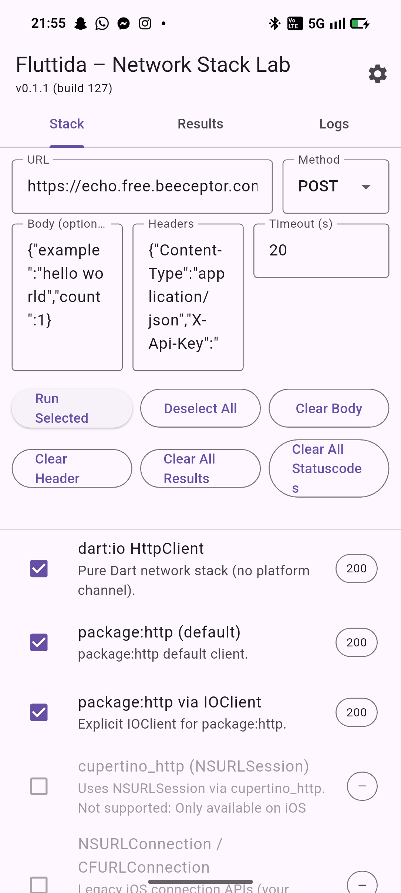
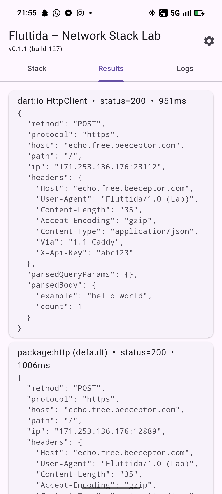
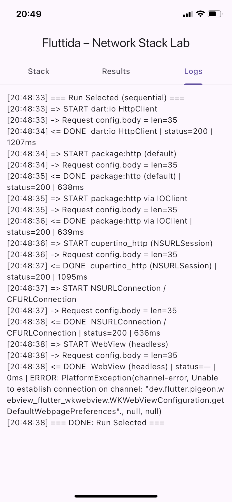

# Fluttida – Intercepting Flutter App Traffic with Frida
This repository provides tools and Frida scripts to analyze, intercept and forward network traffic from Flutter applications via Frida. Because Flutter often bypasses system proxy settings and uses custom networking stacks, standard proxy interception fails. The scripts here help identify which client (e.g. `dart:io`, `NSURLSession`, `NSURLConnection`, or `WKWebView`) is in use and redirect traffic through a proxy for effective reverse engineering.

<div align="center">
  

  <p>
    
    
    
    
    
  </p>
</div>


## Quick Start

1. **Install mitmproxy or Burp Suite** on your analysis machine.  
2. **Export and install the proxy’s CA certificate** on your iOS device, then enable full trust under *Settings --> General --> About --> Certificate Trust Settings*.  
3. **Configure your iPhone’s Wi‑Fi proxy manually** to point to your machine’s IP and chosen port (e.g. `192.168.1.5:8889`).  
4. **Run the proxy** in standard mode (`mitmproxy -p 8889`) or Burp with an “Invisible Proxy” listener.  
5. **Use Frida hooks** to redirect Dart’s `connect()` calls to the proxy (e.g. `frida -n YourApp -l intercept_dartio.js`)
6. **Refresh the app** and watch requests appear in your proxy.  
7. If traffic is still missing, check which networking stack the app uses by running any of the scripts within the [frida_detect_engine](frida_detect_engine) folder ([Dart:io](frida_detect_engine/check_dartio.js), [Cupertino/NSURLSession](frida_detect_engine/check_cupertino.js), [NSURLConnection](frida_detect_engine/check_nsurl.js), [WKWebView](frida_detect_engine/check_webview.js)) and apply the corresponding hook.

---

## Why Flutter Apps Cannot Be Intercepted with a Standard Proxy

Flutter simplifies cross‑platform development, but when it comes to network traffic, it introduces complexities that make traditional proxy interception unreliable. This document explains in detail why Flutter apps often bypass normal proxy setups, the technical background behind it, and what approaches can still work.

---

### Overview

Flutter apps can use different networking stacks depending on the code path. The most common is the Dart‑based `dart:io` HttpClient. Unlike native iOS/Android clients, `dart:io` often ignores system proxy settings and does not perform the expected proxy handshake, which breaks standard interception with tools like Burp or mitmproxy.

- **Core issue:** Many Flutter apps connect directly to target hosts without sending a CONNECT request to the proxy.  
- **Result:** Proxies see no traffic, TLS connections fail, or only raw socket streams appear without host context.  
- **Workarounds:** Transparent interception (NAT/pf/iptables), manual proxy configuration plus hooks, installing custom CA certificates, and bypassing certificate pinning.


This repo includes several scripts to make reverse engineering of flutter APIs easier.
<div align="center">

| Engine / Library                 | Detection (iOS)                                                                 | Detection (Android)                                                              | Intercept (iOS)                                             | Intercept (Android)                                           |
|----------------------------------|----------------------------------------------------------------------------------|-----------------------------------------------------------------------------------|-------------------------------------------------------------|----------------------------------------------------------------|
| dart:io HttpClient               | [frida_detect_engine/check_dartio.js](frida_detect_engine/check_dartio.js)      | Coming soon     | [intercept_dartio.js](intercept_dartio.js)                  | [intercept_dartio.js](intercept_dartio.js)                     |
| package:http (default / IOClient)| Coming soon                                                                      | Coming soon                                                                       | Coming soon                                                 | Coming soon                                                    |
| package:http via IOClient        | Coming soon                                                                      | Coming soon                                                                       | Coming soon                                                 | Coming soon                                                    |
| cupertino_http (NSURLSession)    | [frida_detect_engine/check_cupertino.js](frida_detect_engine/check_cupertino.js)| N/A                                                                               | Coming soon                                                 | N/A                                                            |
| NSURLConnection / CFURL          | [frida_detect_engine/check_nsurl.js](frida_detect_engine/check_nsurl.js)        | N/A                                                                               | Coming soon                                                 | N/A                                                            |
| WKWebView / WebView              | [frida_detect_engine/check_webview.js](frida_detect_engine/check_webview.js)    | Coming soon     | Coming soon                                                 | Coming soon                                                    |
| Android HttpURLConnection        | N/A                                                                              | Coming soon                                                                       | N/A                                                         | Coming soon                                                    |
| Android OkHttp                   | N/A                                                                              | Coming soon                                                                       | N/A                                                         | Coming soon                                                    |
| Android Cronet (embedded)        | N/A                                                                              | Coming soon                                                                       | N/A                                                         | Coming soon                                                    |

</div>
---

### Technical Background

#### Dart:io HttpClient vs. Standard Proxy Usage
- No CONNECT handshake unless explicitly configured.  
- System proxy often ignored.  
- Direct socket calls bypass proxy‑aware APIs.

#### Alternative Stacks
- **Cupertino HTTP (NSURLSession)** – may respect system proxy, but often configured to bypass.  
- **WebView (WKWebView)** – traffic depends on WebKit and system settings.  
- **Native bridges** – custom ObjC/Swift/Java networking stacks may ignore proxy.

#### TLS, HTTP/2, Certificates, and Pinning
- Direct TLS connections cannot be intercepted by a standard proxy.  
- HTTP/2 and ALPN negotiation requires proper TLS termination.  
- ATS and certificate pinning block interception unless bypassed (see [accept_all_certs.js](accept_all_certs.js) for a general ssl pinning bypass) 
- IPv6 and QUIC/HTTP/3 introduce additional challenges.

---

### Symptoms in Practice
- Proxy shows no traffic.  
- mitmproxy transparent mode errors (“cannot resolve original destination”).  
- TLS handshake failures.  
- Partial visibility (only WebView traffic intercepted).

---

### Working Approaches

#### System Proxy + Hooks
- Manual proxy in Wi‑Fi settings.  
- Frida hook on `connect()` to force Dart traffic through proxy.  
- Install and trust proxy CA.  
- Bypass certificate pinning.

#### Transparent Interception (Linux/macOS)
- Use `pf` or `iptables` to redirect traffic.  
- Run mitmproxy in transparent mode.  
- On Windows, use WSL or Burp Invisible Proxy mode.

---

### Detecting Which Stack Is Used
- **Dart:io:** Hook `connect()` in `libsystem_kernel.dylib`.  
- **Cupertino/NSURLSession:** Hook `-[NSURLSession dataTaskWithRequest:completionHandler:]`.  
- **NSURLConnection/CFNetwork:** Hook `+[NSURLConnection sendSynchronousRequest:returningResponse:error:]` or `CFURLConnectionCreateWithRequest`.  
- **WebView:** Hook `-[WKWebView loadRequest:]`.


## Example App: Fluttida ([example_app/fluttida](example_app/fluttida))
<div style="display:flex;gap:8px;align-items:flex-start;">
  
  
  
</div>

This repository includes a small Flutter example app located at [example_app/fluttida](example_app/fluttida). The app is a network-stack lab and playground designed to help you test, compare, and instrument different HTTP clients and platform stacks while using Frida.

How this app helps with Frida
- Playground for multiple stacks: run the same request via `dart:io`, `package:http`, iOS `NSURLSession` (via `cupertino_http`), Android native stacks (HttpURLConnection, OkHttp, Cronet), and a headless WebView — compare results side-by-side.
- Safe instrumentation target: use the app on a device or emulator as a controlled target for Frida scripts so you can attach hooks without affecting production apps.
- Validate hooks & proxying: reproduce real-world scenarios (headers, redirects, TLS behavior) and verify that your Frida scripts (e.g. `intercept_dartio.js`) correctly redirect or modify traffic.
- Debugging helper: the app shows unified results (`status`, `body`, `durationMs`, `error`) and logs, making it easy to observe the effects of your live instrumentation.

Quick steps to use the example app with Frida
1. Run the example app on a device or emulator:

```bash
cd example_app/fluttida
flutter pub get
flutter run
```

2. Attach Frida and load a detection or interception script, for example:

```bash
# list processes and attach by name or PID
frida-ps -Uai
frida -U -n YourApp -l frida_detect_engine/check_dartio.js
# or to intercept
frida -U -n YourApp -l intercept_dartio.js
```

3. Use the app UI to run requests across different stacks and inspect the Results/Logs to confirm whether your hooks or proxying are working as intended.

### Native libcurl stacks (Android NDK and iOS)

The lab app also includes native libcurl stacks to compare behavior outside the platform HTTP clients:

- Android NDK (libcurl)
  - Place your prebuilt `libcurl.so` under:
    - `example_app/fluttida/android/app/src/main/jniLibs/arm64-v8a/libcurl.so`
    - (optional) `example_app/fluttida/android/app/src/main/jniLibs/armeabi-v7a/libcurl.so`
  - TLS verification is enabled by default. To ship a CA bundle, add `cacert.pem` to:
    - `example_app/fluttida/android/app/src/main/assets/cacert.pem`
    - The app copies it to a readable path and sets `CURLOPT_CAINFO` via a pseudo header (`X-Curl-CaInfo`).
  - Debug-only override: set header `X-Curl-Insecure: true` to disable verification (never use in production).
  - In the app, select the stack "Android NDK (libcurl)".

- iOS Native (libcurl XCFramework)
  - Place the XCFramework under:
    - `example_app/fluttida/ios/Frameworks/libcurl.xcframework`
  - The project is wired to link this XCFramework and expose a method channel stack named "iOS Native (libcurl)".
  - Built against Apple Secure Transport (DarwinSSL): no OpenSSL dependency required.
  - If you build your own XCFramework, ensure device (arm64) and simulator (arm64/x86_64) slices are present.

Licenses
- The app includes license files under the XCFramework (e.g., `licenses/COPYING-curl.txt`). Keep third‑party license texts with distributed binaries.

