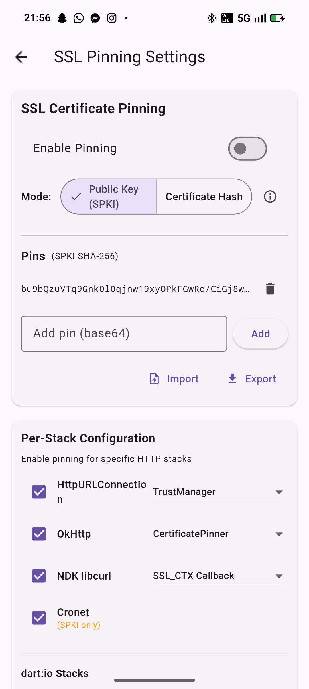

# Fluttida (Network Stack Lab)

<div style="display:flex;gap:8px;align-items:flex-start;width:90%;margin:0 auto;">
  
  
  
  
</div>

<br>

<div align="center">
  <p>
    
    
    
  </p>
</div>


Fluttida is a small Flutter-based network stack lab and test playground. It helps you run the same HTTP request through multiple networking implementations (Dart and native platform stacks), inspect and compare results, and evaluate behavior under instrumentation. It works on both iOS and Android.

## Platform Support

Fluttida runs on both supported mobile platforms. The table below highlights availability per OS:

<div align="center">

| Feature / Stack | iOS | Android |
|---|:--:|:--:|
| dart:io HttpClient |  |  |
| package:http (default) |  |  |
| package:http via IOClient |  |  |
| cupertino_http (NSURLSession) |  |  |
| iOS legacy NSURLConnection |  |  |
| Android HttpURLConnection |  |  |
| Android OkHttp |  |  |
| Cronet (Android) |  |  |
| Headless WebView DOM scraping |  |  |

</div>

## Features
- Multiple network stacks: `dart:io HttpClient`, `package:http` (default), `package:http` via `IOClient`, `cupertino_http` (NSURLSession on iOS), native iOS legacy connection, Android native stacks (HttpURLConnection, OkHttp, Cronet), and a headless WebView DOM scraper.
- Unified result format: each stack returns `status`, `body`, `durationMs`, and `error` (when applicable) so you can compare outputs easily.
- Interactive UI: three tabs — **Stack** (configure request and pick stacks), **Results** (preview and full-screen viewer), and **Logs** (per-run debug output).
- Full-screen viewer: open truncated responses in a selectable, scrollable view with jump-to-end and copy-to-clipboard controls.
- Quick controls: Run Selected, Select/Deselect All, and clear actions for body, headers, results and status codes.

Why use Fluttida as a test playground
- Compare client behavior across Dart, iOS and Android stacks to spot differences in headers, redirects, TLS handling, and response parsing.
- Run Frida scripts and instrumentation in a controlled environment: attach Frida to a running device/emulator to inspect or hook native network APIs and observe how stacks behave under runtime instrumentation.
- Reproduce subtle platform-specific issues before applying fixes in production code.

Quick start
1. Install Flutter and required platform toolchains (Android SDK/NDK, Xcode for iOS).
2. From the app folder, fetch packages and run:

```bash
cd example_app/fluttida
flutter pub get
flutter run
```

Notes
- WebView-based stack: WebView APIs generally do not expose raw HTTP status codes to page scripts; the UI will show `n/a` for status on WebView stacks.
- Native dependencies (e.g. Cronet, OkHttp) can increase binary size and may require extra packaging steps for release (ABI splits, proper gradle settings).

Where to look
- UI & controller: `lib/lab_screen.dart` — request config, controls, results viewer and logs.
- Stack implementations: `lib/stacks/stacks_impl.dart` — Dart implementations and platform channel callers.
- Android native handlers: `android/app/src/main/kotlin/.../MainActivity.kt` (if present) — native HttpURLConnection/OkHttp/Cronet handlers.
- iOS native bridge: `ios/Runner/AppDelegate.swift` (if present) — legacy iOS stack integration.
